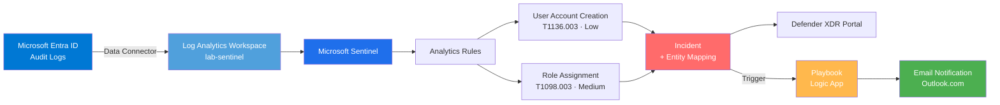

# Lab Architecture

Microsoft Sentinel SOC Lab architecture, design decisions and 
scope. This document describes how each component fits together 
and why each choice was made.

## End-to-end flow

The diagram represents the complete pipeline: from Entra ID audit 
events to the final SOAR notification. Each component is described 
in detail below.

## Components

### Resource Group

All lab resources are grouped under a single Resource Group called 
`rg-lab-sentinel`, located in the `West Europe` region. Grouping 
everything in one Resource Group makes cleanup trivial: deleting 
the Resource Group removes the entire lab in a single operation.

### Log Analytics Workspace

The `lab-sentinel` workspace is the underlying log storage for 
Microsoft Sentinel. All ingested logs are queryable via KQL against 
this workspace. Sentinel does not store data of its own: it operates 
as a SIEM layer on top of Log Analytics.

Retention is left at the default 30 days, which is sufficient for 
lab purposes. In production, retention should be aligned with the 
organization's compliance requirements (typically 90 days or more 
for security logs).

### Microsoft Sentinel

Microsoft Sentinel is enabled on top of the `lab-sentinel` workspace. 
This provides the SIEM and SOAR capabilities: Analytics Rules, 
Incidents, Hunting, Workbooks, Playbooks and Threat Intelligence.

The free trial covers 10 GB per day of ingestion until 13 June 2026. 
After that, lab-scale usage is expected to cost a few cents per day.

### Defender XDR portal integration

The Defender XDR portal (`security.microsoft.com`) is configured to 
use `lab-sentinel` as its Primary Workspace. From this point on, all 
Sentinel functionality (Incidents, Analytics, Hunting) is accessible 
from the unified Defender portal as well as from the Azure Portal.

In production SOC environments, analysts increasingly work from the 
unified Defender portal rather than the technical Azure Portal. The 
lab reflects this convention.

### Data Connector: Microsoft Entra ID

The Entra ID data connector ingests Audit Logs into the workspace. 
Sign-in Logs are excluded because they require an Entra ID P1 or P2 
license, which is out of scope for this lab.

### Analytics Rules

Two scheduled Analytics Rules are deployed:

- `Entra ID - User Account Creation` (MITRE T1136.003, Severity Low)
- `Entra ID - Role Assignment` (MITRE T1098.003, Severity Medium)

Both rules run every hour, looking back at the last hour of data. 
Entity mapping enables cross-rule correlation: when both rules fire 
against the same `TargetUser`, Sentinel automatically links the 
resulting incidents.

### Hunting query

A third query, `Service Principal Creation` (MITRE T1098.001), is 
maintained as a hunting query rather than a deployed rule. It 
surfaces OAuth application registration events, a common cloud 
persistence technique, and is intended for analyst-driven review.

### SOAR Playbook

A Logic App named `pb-notify-sentinel-incident` is configured to 
trigger on incident creation. When triggered, it sends an email 
notification to a dedicated mailbox with dynamic incident metadata: 
Title, Severity, Status and Creation Time.

In production, this notification step would be replaced or augmented 
with Teams alerts, ticketing system integration, automatic 
containment actions or threat intelligence enrichment.

## Scope Decision: Identity-Focused Detection

This lab focuses exclusively on identity-based threat detection 
in Microsoft Entra ID. The scope is intentional and grounded in 
two principles:

1. **Threat landscape priority.** According to recent Microsoft 
   Digital Defense Reports, identity compromise is the most 
   common initial access vector in cloud environments. Detecting 
   account creation, role assignment and identity manipulation 
   delivers the highest ROI per detection rule.

2. **Depth over breadth.** Rather than ingest many low-signal 
   data sources superficially, the lab prioritises mature, 
   well-tuned detection rules on a single high-value source, 
   with full validation, entity mapping and SOAR automation 
   wired end-to-end.

This is consistent with how mature SOCs prioritise detection 
engineering effort: identity-first, with additional data sources 
added incrementally as the detection backlog matures.

### Data sources intentionally out of scope (and why)

| Source | Reason for exclusion |
|---|---|
| Windows Security Events | Requires running VM; cost beyond the lab budget. Future scope. |
| Microsoft 365 Defender (full XDR) | Requires E5 licensing. Future scope when running in an enterprise tenant. |
| Sign-in Logs | Requires Entra ID P1/P2 licence (paid). Documented as architectural limitation. |
| Azure Activity Logs | Available but skipped to keep the scope tightly focused on identity. |
